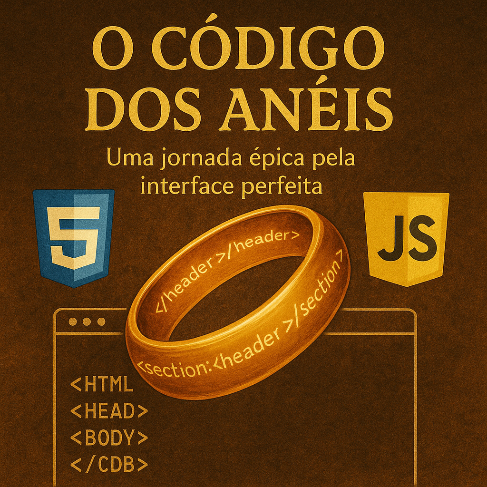

# Projeto Podcast Gerado por I.A.s

 > ℹ️ **NOTE:** Este é o repositório desenvolvido durante uma live no Youtube em parceria com a [DIO](https://dio.me)

Projeto com o objetivo de gerar um podcast utilizando ferramentas de IA através de prompts mais trabalhado.

## ✨ Podcast - “O Código dos Anéis – Uma jornada épica pela interface perfeita”

    <video src="output/podcast-o-codigo-dos-aneis.mp4" controls title="Podcast O Código dos Anéis"></video>

<video width="320" height="240" controls>
  <source src="output/podcast-o-codigo-dos-aneis.mp4" type="video/mp4">
</video>

### **[INTRODUÇÃO]**

Fala, galera! Vocês sabiam que a interface de um site pode ser mais poderosa do que o próprio conteúdo? Pois é! Imagina só abrir um portal com design confuso… já dá vontade de fechar na hora, né? E no episódio de hoje, a gente vai atravessar o universo do front end como verdadeiros portadores do *anel do layout perfeito*. Então prepara o fone, ajeita a cadeira e vem comigo, porque a jornada pela interface ideal… começou!

### **[CURIOSIDADE 1 – CSS]**

Sabia que o CSS, aquele estilo todo bonito dos sites, tem um recurso chamado **“hover”** que deixa os elementos interativos só com o passar do mouse? É tipo magia de invisibilidade ativada quando o usuário se aproxima. Com esse efeito, dá pra criar botões que brilham, mudam de cor ou até tremem como se estivessem pedindo pra serem clicados. E o melhor? Não precisa escrever encantamentos em latim — é só um comando bem simples: :hover. Fala sério, isso é ou não é feitiçaria de interface?

### **[CURIOSIDADE 2 – FERRAMENTA DE FRONT END]**

Agora segura essa dica de ouro dos Elfos do código: tem uma ferramenta chamada **Figma** que é o mapa da Terra Média pros designers de interface. Com ela, dá pra desenhar a tela do site sem precisar programar nada no começo. Você monta a estrutura, testa cores, fontes, e depois passa pros devs com tudo redondinho. É tipo o pergaminho secreto que guia os heróis da usabilidade. E o melhor? Dá pra usar de graça!

### **[FINALIZAÇÃO]**

E aí, curtiu essa jornada mágica pelo mundo do front end? Então compartilha com aquele amigo que tá começando agora no universo das interfaces e quer se tornar um verdadeiro mestre da aparência digital. Eu sou o Peter Script, e esse foi o *O Código dos Anéis* dessa semana. Até a próxima, jovem Padawan da programação visual!

## 💻 Tecnologias utilizadas no projeto

- [ChatGPT](https://chat.openai.com/) 
- [ElevenLabs](https://beta.elevenlabs.io/)
- [Capcut](https://www.capcut.com/pt-br/)

## ✨ Como foi feito ?

- Roteiro gerado via chatgpt
- Audio gerado pela elevenLabs
- ChatGPT Para gerar capa
- Capcut para tratar aúdio e adicionar sons de fundo

## 📚 Materiais

- [Link da live no Youtube](https://www.youtube.com)
- [Notion Template](https://helpful-jump-17b.notion.site/PAS-Podcast-AI-Studio-210489e15d7a4a73b743bb159e45d06f?pvs=4)
- [Editor de aúdio](https://www.capcut.com/editor?from_page=landing_page&__action_from=picture_V%C3%ADdeos%20profissionais%20em%20minutos,%20n%C3%A3o%20em%20horas.)

---

⌨️ com 💜 por [Felipe Aguiar](https://github.com/felipeAguiarCode)
